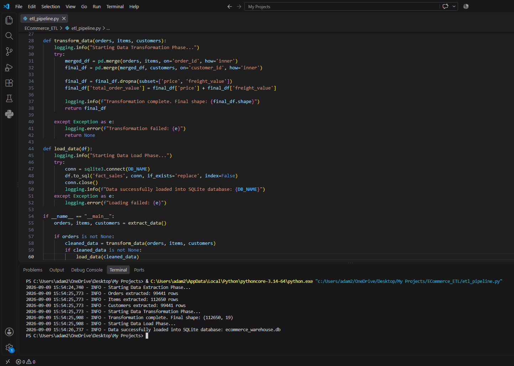
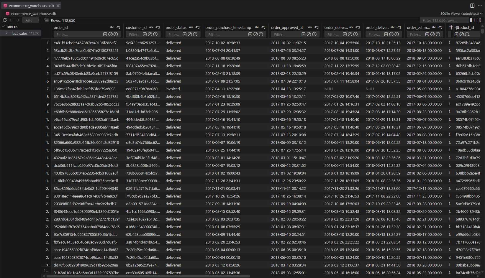

# E-Commerce ETL Data Pipeline

## 📌 Project Overview
Designed and developed an end-to-end ETL (Extract, Transform, Load) pipeline for an E-Commerce dataset. The project involves extracting raw data from multiple sources, transforming it for business intelligence purposes, and loading it into a relational database for efficient querying.

## 🛠️ Tech Stack
* **Language:** Python
* **Data Processing:** Pandas
* **Database:** SQLite
* **Pipeline Structure:** Modular Python Scripts

## ⚙️ Pipeline Architecture
1. **Extract (E):** Loaded multiple raw CSV files (e.g., `olist_customers_dataset.csv`, `olist_orders_dataset.csv`, `olist_order_items_dataset.csv`) from the `data/raw/` directory.
2. **Transform (T):**
   * Cleaned the data by handling missing values and correcting data types.
   * Merged multiple dataframes to create a centralized analytical view.
   * Engineered new features (e.g., total order value, delivery time).
3. **Load (L):** Created a database connection and loaded the processed data into a structured SQLite database (`ecommerce_warehouse.db`) ready for BI tools and SQL analysis.

## 📊 Key Highlights
* Automated the data cleaning and merging process.
* Built a structured project layout with separate `data/raw/` and `data/processed/` directories.
* Used logging to track the pipeline's execution steps.

## 📷 Visual Proof

### 1. Pipeline Execution Logs

### 2. Loaded SQLite Database
